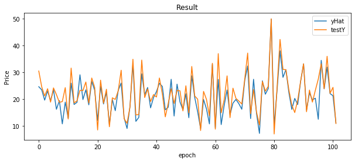

# Practice: markdown grammar

## Title (heading)

* Can designate the level (1-6) of headings with the number of `#`s.

  ### Level 3

  #### Level 4

  ##### Level 5

  ###### Level 6

## List

* Can create lists without order with `*`
  - Can create sublists using `tab`
  - `enter` / `return`
* Can create as an upper-level list using`shift + tab`

1. Numbered list can be created with `1.`
2. Like this
   1. Can create numbered sublists as well
      * Can combine with lists without orders

## Code block

* Can create code blocks with ` ``` ` or `~~~`
  * e.g.
```python
from tensorflow.keras import optimizers
from tensorflow.keras import regularizers
```

## Inline code block

* Can be used as follows

  - e.g.

    This project has implemented `tensorflow`

## Other text-related grammar

* Surround text with `*`: *italic*

* Surround text with `**`: **bold**

* Surround text with `~~`: ~~strikeout~~

## Link

- [Google](http://www.google.com/ncr)

## Image



## Table

| Header 1  | Header 2  |
| --------- | --------- |
| Content 1 | Content 3 |
| Content 2 | Content 4 |